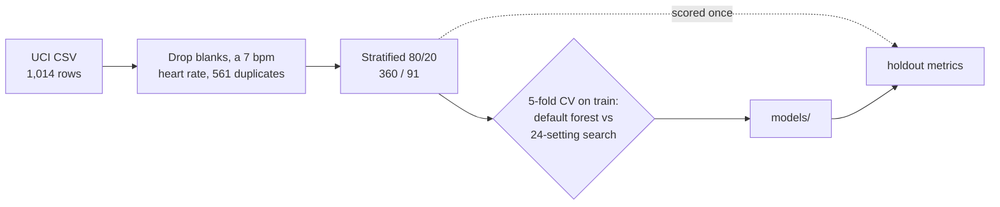

# Maternal Health Risk Triage

[](https://github.com/alecokelberry/maternal-health-risk-triage/actions/workflows/ci.yml)

Classifies a pregnant patient as **low, mid, or high risk** from six routine vitals, using a random forest
trained on a public UCI dataset. It's a command-line tool with a reproducible training pipeline and
honestly reported metrics.

> **Not a diagnostic device.** This is a portfolio project trained on 451 records. Don't use it for care
> decisions.

## Results

| Metric (holdout, 91 rows, scored once)    |     Score |
| ----------------------------------------- | --------: |
| Weighted F1                               | **0.632** |
| Accuracy                                  |     0.637 |
| Macro F1                                  |     0.598 |
| Majority-class weighted F1 (for scale)    |     0.352 |
| Cross-validated weighted F1 (train, 5×)   | 0.688 ± 0.048 |

| Risk | Precision | Recall |   F1 | Rows |
| ---- | --------: | -----: | ---: | ---: |
| High |      0.76 |   0.70 | 0.73 |   23 |
| Low  |      0.67 |   0.74 | 0.71 |   47 |
| Mid  |      0.39 |   0.33 | 0.36 |   21 |

The model misses the 0.80 target it was built toward. **Mid risk is the weak class**: it mostly gets
confused with low. The costliest error is **6 of 23 high-risk patients scored as low**. Blood sugar is by
far the most important feature, followed by systolic pressure. Full numbers are in
[`results/metrics.json`](results/metrics.json).

### Why the scores dropped in v1.1

**561 of the 1,014 rows in the public CSV are exact duplicates.** Version 1.0 split the rows randomly, so
copies of the same record ended up in both training and test, and the holdout weighted F1 came out at
0.868. Removing duplicates before the split gives the 0.632 above. That number shows how the model does
on records it hasn't seen. A test asserts that the two splits share no rows.

## Approach



1. **Clean.** Drop rows with blank or non-numeric vitals, physiologically impossible readings, and exact
   duplicates. Each step is counted in `metrics.json`.
2. **Split** 80/20, stratified by class, with a fixed seed.
3. **Choose** between a default random forest and a 24-setting `RandomizedSearchCV`, using
   cross-validated weighted F1 on the training rows only. The search won: 0.688 against 0.644.
4. **Score** the chosen model on the holdout exactly once.
5. **Predict.** If a vital is outside the range seen in training, a warning goes to stderr. You also get
   a warning if your scikit-learn version differs from the one that trained the model.

| Input        | Flag           | Unit   |
| ------------ | -------------- | ------ |
| Age          | `--age`        | years  |
| Systolic BP  | `--systolic`   | mmHg   |
| Diastolic BP | `--diastolic`  | mmHg   |
| Blood sugar  | `--bs`         | mmol/L |
| Body temp    | `--temp`       | °F     |
| Heart rate   | `--heart-rate` | bpm    |

## Run it

Python 3.11+.

```bash
python -m venv .venv && source .venv/bin/activate
pip install -r requirements.txt          # exact versions the model was trained with
python -m triage predict --age 25 --systolic 130 --diastolic 80 --bs 15 --temp 98 --heart-rate 86
```

```text
high risk
  high risk 0.76  mid risk 0.20  low risk 0.04
```

```bash
python -m triage train   # ~40 s; rewrites models/, results/, data/processed/
```

Training is deterministic. Rerunning it with `requirements.txt` installed reproduces the committed model
and metrics byte for byte. Exit codes: `0` success, `1` missing model or CSV, `2` bad arguments, such as
a non-positive vital.

## Tests

```bash
python -m unittest discover -s tests -v                         # 29 tests, ~4 s
pip install -e ".[dev]" && ruff check . && mypy && pytest       # lint, types, tests
```

CI runs lint, strict mypy, and the tests on Python 3.11–3.13.

## Project structure

```text
triage/
  data.py      load, clean, split, training ranges
  model.py     forest, CV, search, holdout metrics, majority baseline
  train.py     the training pipeline and report writer
  predict.py   load artifacts, score one row, warnings
  cli.py       `train` and `predict` commands
data/raw/      UCI Maternal Health Risk CSV (CC BY 4.0)
models/        shipped forest (270 KB), label encoder, metadata.json
results/       metrics.json and evaluation_summary.txt from the last training run
tests/         unittest suite, one file per module
```

The model is committed so `predict` works right after cloning. `data/processed/` is regenerated by
`train` and isn't tracked.

## Limitations

- **Small data:** 451 unique rows and a 91-row holdout, so each score could move several points with a
  different seed. The CV standard deviation is ±0.05.
- **Label noise:** 71 rows share identical vitals with a row that has a different label. No model can
  get all of those right.
- **One population:** rural clinics in Bangladesh, collected with one IoT device. 78% of rows record
  a body temperature of exactly 98 °F, so that feature varies very little.
- **No calibration:** the printed probabilities are raw forest vote shares, not calibrated risks.
- Impurity-based feature importance favors continuous features and doesn't show cause and effect.

## Data and license

Ahmed, M., Kashem, M. A., Rahman, M., and Khatun, S. *Maternal Health Risk*. UCI Machine Learning Repository,
[10.24432/C5DP5D](https://doi.org/10.24432/C5DP5D). CC BY 4.0. The code is [MIT](LICENSE). The CSV stays CC BY 4.0.
