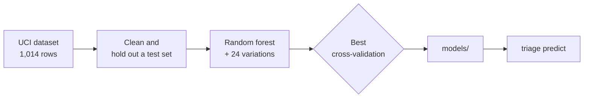

# Maternal Health Risk Triage

Ranks which pregnant patients should get a follow-up call first, from six routine vitals. It's a triage aid, not a
diagnosis.

1,014 rows from clinics in rural Bangladesh go in, and each one comes back as low, mid or high risk.

## Results

I trained a plain random forest and then tried 24 other setups. Cross-validation liked the plain one (0.817 against
0.808), so that's what's in `models/`. On the holdout set, scored after picking the model, weighted F1 is **0.868**.

| Risk | Precision | Recall |   F1 | Rows |
| ---- | --------: | -----: | ---: | ---: |
| Low  |      0.89 |   0.82 | 0.85 |   81 |
| Mid  |      0.77 |   0.87 | 0.82 |   67 |
| High |      0.96 |   0.95 | 0.95 |   55 |

Mid is the one it mixes up the most. The splits lean on blood sugar first, then systolic pressure, then age.

## How it works



| Input        | Unit   |
| ------------ | ------ |
| Age          | years  |
| Systolic BP  | mmHg   |
| Diastolic BP | mmHg   |
| Blood sugar  | mmol/L |
| Body temp    | °F     |
| Heart rate   | bpm    |

## Running it

Python 3.11 or newer.

```bash
python3 -m venv .venv
source .venv/bin/activate
pip install -r requirements.txt
python3 -m triage predict --age 25 --systolic 130 --diastolic 80 --bs 15 --temp 98 --heart-rate 86
```

```text
high risk
  high risk 0.84  mid risk 0.15  low risk 0.01
```

That's the first row of the CSV.

| Command                                    | What it does                                             |
| ------------------------------------------ | -------------------------------------------------------- |
| `python3 -m triage predict …`              | Scores one set of vitals                                 |
| `python3 -m triage train`                  | Refits both models and rewrites `models/` and `results/` |
| `python3 -m unittest discover -s tests -v` | Runs the tests                                           |

## Data and license

The data was collected with an IoT monitor and published by Ahmed, Kashem, Rahman and Khatun: UCI Maternal Health
Risk, [10.24432/C5DP5D](https://doi.org/10.24432/C5DP5D), CC BY 4.0. The code is [MIT](LICENSE); the CSV stays
CC BY 4.0.
